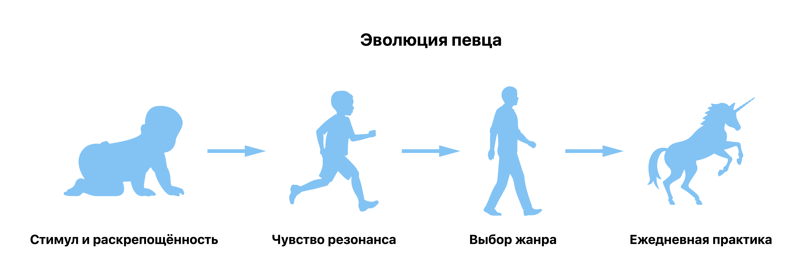

# Как научиться петь?

В этой статье мы не ставим цель победить в профессиональном вокальном конкурсе. Я расскажу о простых шагах, пройдя которые, уже через 2 месяца каждый споёт любимую песню так, что всем вокруг понравится.

## 1. Получите стимул

Сейчас абсолютно серьезно: без этого можно не продолжать. Назовите себе самую главную причину, по которой вы хотите научиться петь. Если не можете назвать – придумайте и поверьте в неё. 

Например, кто-то начинает петь, потому что хочет радовать свою половинку, а кто-то – чтобы внуки гордились и брали пример. Может быть, вам нравится представлять себя на сцене в свете софитов и это поднимает вам настроение на весь день – поздравляем, у вас уже отличная мотивация!

Повторяйте, как только захотите опустить руки.

## 2. Раскрепоститесь

Обучение пению – процесс, связанный с большими сомнениями: результат проявляется не мгновенно, а ощущение неловкости будет с вами почти всегда. Частая причина этого: "Я чувствую себя глупо!". 

Послушайте, вы имеете полное право позволить себе глупости хотя бы на 15 минут в день. Во-первых, это поможет делу. Во-вторых, у вас есть целый восьмичасовой рабочий день на серьёзные дела! 

Повторяйте каждый раз, когда захотите спеть.

## 3. Почувствуйте резонанс

Этот навык помогает попадать в ноты. Если вы уже попадаете – смело пропускайте это шаг.

Резонанс – понятие из школьной физики, но сейчас мы обойдемся без сложных формул. Вам понадобится помощник: ему нужно будет долго произносить один любой звук на его выбор (например, "ыыы!"), а вам – точь-в-точь повторять за ним. Да, как будто вам 11 лет и вы передразниваете своего одноклассника. Просите помощника менять звуки (например, менять "ыыы" на "ааа", "ооо" и т.д), а сами изо всех старайтесь максимально точно повторить звук за ним. Если почувствуете себя глупо, [раскрепоститесь](https://camo.githubusercontent.com/383e644a4ce001e74f8702413bfdc8ca2e10753dee01a2ccf4866ad84c5e5cd4/687474703a2f2f7777772e706c616e74756d6c2e636f6d2f706c616e74756d6c2f706e672f5250386e4a69443035344a7846534d63396e55573842614134644830305136467849415738383965613131495931325944494f636e617843355552565931616a69325159796b685f634a565f78746675446a655f3750715637706453736a4a747a706d55614d44623654502d722d46354b68475551764a4f73346f3762664b41314965524b724851456c326b752d614a38504a433271636e506873392d304c5135464762626a674c4c437a344a5970704461506b324d662d49746f6f6343576b354b2d70646a6a6f5465443246377273654b34504d646569554d6f386231586c51326f4272335a456435306a54496152516a376b4b35586334734d5a7446356f75507139386470385a7870646a65745455473831544b6e767563324c4564386a6a5163384676456b576a6d6f357548526b764b4b6a44484952716261466a327069596267764442546972793774596b68314a555f6a6a493737316c4a583867787746774b457431546d447a646577675967614e7a517a564c4875306b4547766f477975496b67734d6d6966634f54376c5874335f7a426a667972315a5473444a4a4c7a303648457a37316648723752336d7643335f675056).

> Когда друг устанет, приобретите любой клавишный музыкальный инструмент и повторяйте звуки, которые будет издавать он.

Вы услышите, когда у вас получится: громкость звука как будто удвоится. Вы ощутили резонанс! 

Повторяйте, пока не запомните это ощущение. 

## 4. Выберите жанр и несколько композиций

Исходите из [стимула](https://camo.githubusercontent.com/383e644a4ce001e74f8702413bfdc8ca2e10753dee01a2ccf4866ad84c5e5cd4/687474703a2f2f7777772e706c616e74756d6c2e636f6d2f706c616e74756d6c2f706e672f5250386e4a69443035344a7846534d63396e55573842614134644830305136467849415738383965613131495931325944494f636e617843355552565931616a69325159796b685f634a565f78746675446a655f3750715637706453736a4a747a706d55614d44623654502d722d46354b68475551764a4f73346f3762664b41314965524b724851456c326b752d614a38504a433271636e506873392d304c5135464762626a674c4c437a344a5970704461506b324d662d49746f6f6343576b354b2d70646a6a6f5465443246377273654b34504d646569554d6f386231586c51326f4272335a456435306a54496152516a376b4b35586334734d5a7446356f75507139386470385a7870646a65745455473831544b6e767563324c4564386a6a5163384676456b576a6d6f357548526b764b4b6a44484952716261466a327069596267764442546972793774596b68314a555f6a6a493737316c4a583867787746774b457431546d447a646577675967614e7a517a564c4875306b4547766f477975496b67734d6d6966634f54376c5874335f7a426a667972315a5473444a4a4c7a303648457a37316648723752336d7643335f675056) (вдруг вашей половинке нравится что-то особенное?) и возможности чувствовать [резонанс](https://camo.githubusercontent.com/383e644a4ce001e74f8702413bfdc8ca2e10753dee01a2ccf4866ad84c5e5cd4/687474703a2f2f7777772e706c616e74756d6c2e636f6d2f706c616e74756d6c2f706e672f5250386e4a69443035344a7846534d63396e55573842614134644830305136467849415738383965613131495931325944494f636e617843355552565931616a69325159796b685f634a565f78746675446a655f3750715637706453736a4a747a706d55614d44623654502d722d46354b68475551764a4f73346f3762664b41314965524b724851456c326b752d614a38504a433271636e506873392d304c5135464762626a674c4c437a344a5970704461506b324d662d49746f6f6343576b354b2d70646a6a6f5465443246377273654b34504d646569554d6f386231586c51326f4272335a456435306a54496152516a376b4b35586334734d5a7446356f75507139386470385a7870646a65745455473831544b6e767563324c4564386a6a5163384676456b576a6d6f357548526b764b4b6a44484952716261466a327069596267764442546972793774596b68314a555f6a6a493737316c4a583867787746774b457431546d447a646577675967614e7a517a564c4875306b4547766f477975496b67734d6d6966634f54376c5874335f7a426a667972315a5473444a4a4c7a303648457a37316648723752336d7643335f675056). В начале вашей сольной карьеры не нужно петь что-то, к чему не лежит душа, и тратить силы на звуки, которые вы не сможете повторить.

Послушайте несколько песен на выбор. Поймите, ощущаете ли вы резонанс своего голоса с голосом исполнителя большую часть времени композиции? Если так, берите её в репертуар и переходите к следующему шагу.

## 5  Пойте

Как бы банально это ни звучало. Ведь, по большому счёту, теперь это ваш единственный ключ к успеху. 

Пойте в автомобиле или в душе, громко или себе под нос, для себя или своего ребёнка. Можно сколько угодно говорить про "опору", "диафрагму", "резонаторы" и прочие неизвестные новичкам слова, но без ежедневной практики навык могут потерять даже профессиональные певцы. 

Повторяйте всю оставшуюся жизнь.

## Схема для тех, кому лучше картинками

Вот и всё! Если вы всё сделали по этой инструкции и поёте каждый день при каждом удобном случае, то уже через два месяца вы сможете получить первые приятные впечатления. Можно смело идти с друзьями в караоке!
